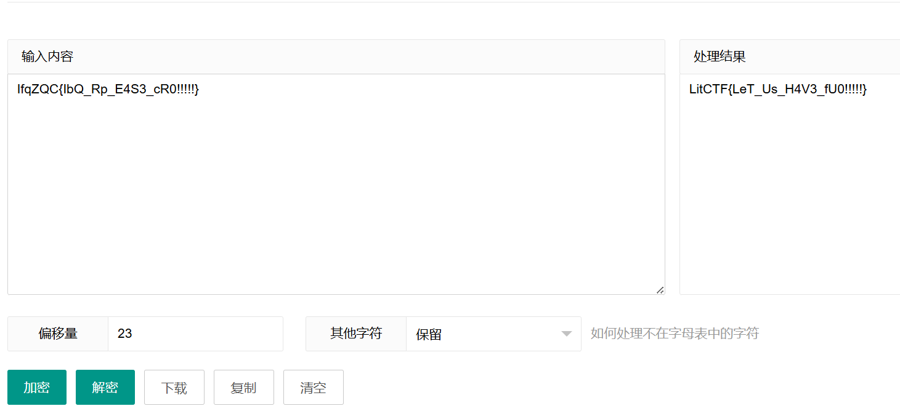

# 2025-01-13 题单

## 今日主题关键词

新手, MISC, 签到

## 今日题目

- [x] 10金币 [LitCTF 2023]404notfound (初级) https://www.nssctf.cn/problem/3881 ✅ 2025-01-13
- [x] 10金币 [LitCTF 2023]What_1s_BASE (初级) https://www.nssctf.cn/problem/3879 ✅ 2025-01-13
- [x] 20金币 [HDCTF 2023]hardMisc https://www.nssctf.cn/problem/3796 ✅ 2025-01-13
- [x] 10金币 [LitCTF 2023]Hex？Hex！(初级)  https://www.nssctf.cn/problem/3887 ✅ 2025-01-13
- [x] 10金币 [LitCTF 2023]Is this only base?  https://www.nssctf.cn/problem/3968 ✅ 2025-01-13
- [x] 10金币 [LitCTF 2023]就当无事发生 https://www.nssctf.cn/problem/3862 ✅ 2025-01-13

### 404notfound (初级)

解压文件后得到一个图片：（应该是图片隐写题）


该图片可以正常打开，查看属性中的详细信息后没有发现任何内容，然后直接放入stegsolve中查看各通道并未发现有隐含信息，使用十六进制编辑器（010editor，winhex……）打开图片后搜索ctf得到flag(这里也可以在linux终端中使用cat命令查看文件中的可打印字符的情况)


>LitCTF{Its_404_but_1ts_n0t_a_page}

### What_1s_BASE (初级)

[base64是什么？](https://en.wikipedia.org/wiki/Base64)

看题目盲猜是有关于base家族密码的，下载后得到一个txt文件，里面内容是：

>TGl0Q1RGe0tGQ19DcjR6eV9UaHVyM2RheV9WX21lXzUwfQ==

一眼base64，直接打开[CyberChef](https://cyberchef.org/)炒一炒后得到答案


>LitCTF{KFC_Cr4zy_Thur3day_V_me_50}

### hardMisc

下载题目附件后得到一张图片：


第一步先查看属性详细信息，似乎没有什么信息，但是发现宽高的像素数不相等，直觉上觉得这张图片应该是正方形的，有可能存在宽高隐写，先不急着做，看看别的信息


使用stegsolve打开图片，查看各个通道也没信息

使用十六进制编辑器打开图片文件，发现文件末尾有一串不属于图片本身结构的信息，一眼base64（这个同样可以用cat命令输出最后的字符串哦，可以自行尝试）


得到答案：


>HDCTF{wE1c0w3_10_HDctf_M15c}

### Hex？Hex！(初级)

下载附件后得到一串字符串

>4c69744354467b746169313131636f6f6c6c616161217d

根据题目直接猜是hex转换的题目，依旧直接放入cyberchef里直接炒得到答案


>LitCTF{tai111coollaaa!}

### Is this only base?

看到题目盲猜套娃题且至少有一次是base解码

下载附件得到内容如下：

>SWZxWl=F=DQef0hlEiSUIVh9ESCcMFS9NF2NXFzM
>今年是本世纪的第23年呢

第一行应该是base，使用base家族的各个解密后得到的都是乱码，证明base应该是第二步，看到第二行有信息23，猜想可能是凯撒密码，偏移量是23，发现均不可以正常解码，猜想可能是栅栏密码


得到

>SWZxWlFDe0liUV9ScF9FNFMzX2NSMCEhISEhfQ==

base64解码后得到


>IfqZQC{IbQ_Rp_E4S3_cR0!!!!!}

看上去答案很接近了，再使用凯撒密码将ZQC的位置变换为23为CTF试试



>LitCTF{LeT_Us_H4V3_fU0!!!!!}

### 就当无事发生

得到一个题目和描述

>https://ProbiusOfficial.github.io 
>差点数据没脱敏就发出去了，还好还没来得及部署，重新再pull一次（x  
>Flag形式 NSSCTF{}  
>出题人 探姬

发现一个url，去看看有什么


发现这个url原来是出题者大佬探姬夹带的私货，发现里面有好多干货值得我们新手学习，收藏学习了


因为题目中有`差点数据没脱敏就发出去了，还好还没来得及部署，重新再pull一次（x`和题目的tag中的信息，应该是信息泄露，尤其可能是.git，先用kali中的dirsearch扫一遍

```bash
dirsearch -u https://probiusofficial.github.io/ 
```

使用默认字典扫描时结果如图：


扫了几遍都没结果，也翻找了网站的各处都没发现信息，缴械投降了，去看wp

寄，原来github.io网站的搭建基于github上的项目[GitHub Pages 快速入门- GitHub 文档](https://docs.github.com/zh/pages/quickstart)，可以通过查看commit记录，原来它题目中的`差点数据没脱敏就发出去了，还好还没来得及部署，重新再pull一次（x`是又pull了一遍项目然后修改后push上去的意思，没这知识点真想不到，晕。

网上查找了一下LitCTF的举办时间


从该网站项目的比赛前的最新一次commit记录往前找


得到flag

>LitCTF{g1thub_c0mmit_1s_s0_us3ful}