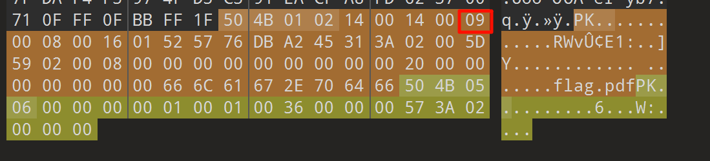

# 2025-01-15 题单

## 今日主题关键词

新手, MISC, 签到

## 今日题目

- [x] 10金币 [[MoeCTF 2022]寻找黑客的家](https://www.nssctf.cn/problem/3314) ✅ 2025-01-13
- [x] 10金币[[MoeCTF 2022]zip套娃](https://www.nssctf.cn/problem/3313) ✅ 2025-01-13
- [x] 20金币[[FSCTF 2023]最终试炼hhh](https://www.nssctf.cn/problem/4601) ✅ 2025-01-13
- [x] 10金币[[网鼎杯 2022 玄武组]misc999](https://www.nssctf.cn/problem/2572) ✅ 2025-01-13
- [x] 10金币[[SDCTF 2022]Case64AR](https://www.nssctf.cn/problem/2378) ✅ 2025-01-13


### 寻找黑客的家

>大黑客Mikato期末结束就迫不及待的回了家，并在朋友圈发出了“这次我最早”的感叹。那么你能从这条朋友圈找到他的位置吗？
>moectf{照片拍摄地市名区名路名} (字母均小写)
>例如：西安市长安区西沣路：moectf{xian_changan_xifeng}
>https://github.com/XDSEC/MoeCTF_2022

解压附件后得到两张图片


看到第一张图片马路尽头中有《创铭大》猜测最后一个字是厦，旁边有宜家便利店，左侧应该是一个商场，右侧有个足疗的汉明宫，直接在地图上搜索汉明宫

在地图上搜汉明宫：


看到这家汉明宫的图标与题目中的图标相同，门面中的大理石门楣和led灯相同


得到答案

>NSSCTF{shenzhen_longhua_qingquan}

### zip套娃

>zip套娃娃娃

看来是有关于zip的相关知识点的题目，下载得到一个压缩包，尝试直接解压，发现需要密码

[【CTF 攻略】CTF比赛中关于zip的总结 - M4x - 博客园](https://www.cnblogs.com/WangAoBo/p/6944477.html)

使用bandzip查看里面内容，两个文件夹都是已加密的：


zip属性中详细信息也没有任何内容，用010editor打开


发现chunk[4]存在crc不匹配情况（可能是bug），但无法解决当前压缩包问题，同时并没发现有伪加密等其他可能的情况，直接用apchpr进行爆破尝试，得到密码1235，成功解压压缩包


得到的密码txt中内容

>密码的前七位貌似是1234567
>后三位被wuliao吃了

根据信息对fl.zip进行掩码爆破


根据爆破出来的口令解压压缩包得到两个文件，其中一个密码.txt与之前的一样，重复的，尝试解压fla.zip需要密码，用010打开查看fla.zip发现存在zip伪加密，将1改成0后保存即可


解压后得到flag

>moectf{!zip_qwq_ZIP}

### 最终试炼hhh

下载附件得到一个名为flag无后缀的文件，放入kali里使用file命令

```bash
file ./flag
```


发现并不能看出是什么文件，使用010editor打开，看到文件尾是`04 03 4B 50`，应该是一个压缩包被倒置了，意识到这里需要将文件倒置

用ai写了一个简易的文件倒置脚本

```python
def reverse_binary_file(input_file, output_file):
    # 读取输入文件的所有字节
    with open(input_file, 'rb') as f:
        content = f.read()
    
    # 将字节内容倒序
    reversed_content = content[::-1]
    
    # 写入新文件
    with open(output_file, 'wb') as f:
        f.write(reversed_content)

def main():
    input_file = input("请输入源文件路径: ")
    output_file = input("请输入目标文件路径: ")
    
    try:
        reverse_binary_file(input_file, output_file)
        print(f"文件已成功倒置并保存到: {output_file}")
    except Exception as e:
        print(f"发生错误: {str(e)}")

if __name__ == "__main__":
    main()
```

发现是倒置后的结果是正常的


解压的时候发现需要密码，查看010发现是伪加密，将9改成偶数




解压后得到一个pdf文件，粗略查看后发现内容里并没有什么特别的，使用wbstego对这个pdf进行解码后得到结果FSCTF{cmdgy_yyds}，改成NSSCTF后发现结果不对，最终flag就是

>FSCTF{cmdgy_yyds}

### misc999

下载附件后得到一个文件，内容如下：

>表 9876543210qwertyuiopasdfghjklzxcvbnmMNBVCXZLKJHGFDSAPOIUYTREWQ
>密文 7dFRjPItGFkeXAALp6GMKE9Y4R4BuNtIUK1RECFlU4f3PomCzGnfemFvO

看到后感觉是替换了字母表的加密，又因为题目描述是base，猜测应该是base家族，且字母表有62个，应该是base62，替换码表后放入cyberchef炒一下直接得到答案


答案是

>flag{cf492422-13cb-4123-8bc5-5495f0349494}

### Case64AR

题目如下：

>Someone script kiddie just invented a new encryption scheme. It is described as a blend of modern and ancient cryptographic techniques. Can you prove that the encryption scheme is insecure by decoding the ciphertext below?
>
>Ciphertext: OoDVP4LtFm7lKnHk+JDrJo2jNZDROl/1HH77H5Xv

对题目的翻译如下：

>某个脚本小子发明了一种新的加密方案。它被描述为现代和古代密码技术的混合。你能通过解码下面的密文来证明这个加密方案是不安全的吗？

看来是古典密码和一些现代密码的结合，发现密文有40个字符且里面的字符都在base64码表里，尝试一下标准码表下的base64，发现结果是乱码，但是感觉就是base64，可能是凯撒后进行base64，然后突然发现题目好像就是这个意思Case64AR，后面的AR暂且先不管，使用ai帮我写一个先使用凯撒密码解密后用base64解码的代码

```python
import base64

def caesar_decrypt(ciphertext, shift):
    """凯撒解密函数"""
    base64_chars = "ABCDEFGHIJKLMNOPQRSTUVWXYZabcdefghijklmnopqrstuvwxyz0123456789+/"
    decrypted_text = ""
    for char in ciphertext:
        if char in base64_chars:
            original_index = base64_chars.index(char)
            decrypted_index = (original_index - shift) % 64
            decrypted_text += base64_chars[decrypted_index]
        else:
            decrypted_text += char  # 保留非Base64字符
    return decrypted_text

def try_decode(ciphertext):
    """尝试不同偏移量并解码"""
    for shift in range(64):
        decrypted = caesar_decrypt(ciphertext, shift)
        try:
            decoded = base64.b64decode(decrypted).decode('utf-8')
            print(f"Shift {shift}: {decoded}")
        except:
            continue  # 如果解码失败，跳过

# 你的密文
ciphertext = "OoDVP4LtFm7lKnHk+JDrJo2jNZDROl/1HH77H5Xv"
try_decode(ciphertext)
```

得到答案：

>sdctf{OBscUr1ty_a1nt_s3CURITy}

总共耗时1.5h

总结一下，这次的题单难度确实比上一次高一些，了解了更多zip的知识点